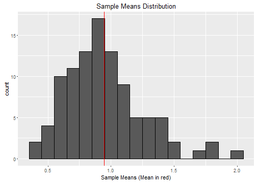

## The Central Limit Theorem
 1. If you take any distribution and take samples of that distribution, then the means of that many samples form a normal distribution.
 2. The mean of these new sample means approximate the mean value of the source distribution.
 3. The standard deviation of the sample means approximate the standard deviation of the source distribution devided by the square root of the sample size.

For example you have 1000 observations which follow an exponential distribution. From that distribution you take 10 samples and calculate their mean value. You do that 100 times. The distribution of these 100 means should be normally distributed, even though the source distribution followed an exponential distribution. If you calculate the mean value of that 100 sample means, it should be very close to the mean value of the source distribution. If you calculate the standard deviation of the 100 sample means and multiply it by the square root of 10 - the sampel size - you should be very close to the standard deviation of the source distribution.

--- .class #id 

## Example Visualized, Exponential Distribution

Here we see a histogram of an exponential distribution with 1000 observations. It's mean is 0.9660901 and it's standard deviation is 0.9844057

--- 

## Example Visualized, Sample Means Distribution

We took 10 samples anc calculated their mean. That was repeated 100 times. The distribution of the 100 means is plotted here. It looks like a normal distribution. It's mean is 0.9339488 and it's standard deviation is 0.2992768. Multiplied by the square root of 10, the approximated standard deviation is 0.9463965.

--- 

We see that the central limit theorem seems to be true, what about a more observations in the source distribution and a bigger sample size?
We will now generate a distribution with 100000 observations and take samples of size of 67 and repeat that 1000 times.

Now we see the form of a normal distribution a little bit better.

The source distributions mean is 0.998029 and it's standard deviation is 1.0008479

The mean of the sample means is 1.006168 and it's standard deviation is 0.1261716. Multiplied by the square root of 67, the approximated standard deviation is 1.0327592.
